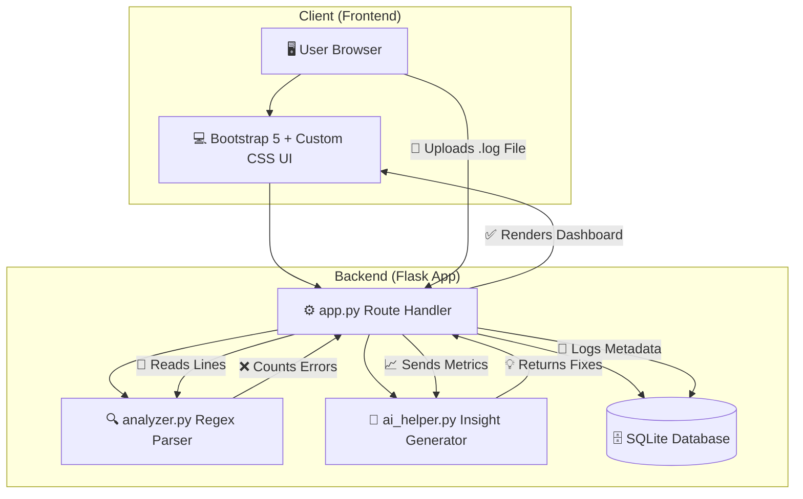

<div align="center">
  <h1>🚀 NetAssist AI - Network Log Analyzer</h1>
  <p>
    <b>Smart Log Parsing & Automated Troubleshooting</b>
  </p>
  <p>
    
    
    
    
  </p>
</div>
# 🚀 NetAssist AI - Network Log Analyzer


---
## 📖 About The Project
**NetAssist AI** is an advanced network log analysis dashboard designed to help Support Engineers, DevOps professionals, and NOC teams quickly identify and summarize issues in massive log files. Featuring a premium, glassmorphism-styled UI, the application automatically scans server, router, and application logs to aggregate critical events.
**NetAssist AI** is an advanced network log analysis dashboard designed to help Support Engineers, DevOps professionals, and NOC teams quickly identify and summarize issues in massive log files. Featuring a premium, glassmorphism-styled UI built with **Bootstrap 5 and custom CSS**, the application automatically scans server, router, and application logs to aggregate critical events.
The system features a **Simulated AI Insight Engine** that analyzes the parsed data to generate human-readable summaries and provide actionable troubleshooting fixes—transforming hours of manual log reading into instant, actionable intelligence.
🌍 **Live Demo:** [https://network-log-analyzer.onrender.com/](https://network-log-analyzer.onrender.com/)
---
## ✨ Key Features
- **🔍 Smart Regex Parsing** – Automatically detects, extracts, and counts `ERROR`, `WARNING`, `FAILED`, and `TIMEOUT` events from massive log files using highly optimized regular expressions.
- **🧠 AI Insights & Fix Generator** – Analyzes log anomalies and dynamically generates realistic, context-aware troubleshooting steps and incident summaries.
- **📊 Real-Time Metrics Dashboard** – Visualizes log health instantly upon upload, displaying exact line numbers and code snippets for critical failures.
- **💾 Persistent Metadata Logging** – Stores the history of uploaded files and their parsed metrics in an SQLite database for auditing.
- **🎨 Premium Enterprise UI** – Built with a stunning dark-mode/glassmorphism aesthetic using Bootstrap 5 and custom CSS for a modern NOC feel.
- **☁️ Cloud-Ready Architecture** – Configured with Gunicorn and a clean dependency structure for immediate deployment to Render or Heroku.
- 🔍 **Smart Regex Parsing** – Automatically detects, extracts, and counts `ERROR`, `WARNING`, `FAILED`, and `TIMEOUT` events from massive log files using highly optimized regular expressions.
- 🧠 **AI Insights & Fix Generator** – Analyzes log anomalies and dynamically generates realistic, context-aware troubleshooting steps and incident summaries.
- 📊 **Real-Time Metrics Dashboard** – Visualizes log health instantly upon upload, displaying exact line numbers and code snippets for critical failures.
- 💾 **Persistent Metadata Logging** – Stores the history of uploaded files and their parsed metrics in an SQLite database for auditing.
- 🎨 **Premium Enterprise UI** – Built with a stunning dark-mode/glassmorphism aesthetic using Bootstrap 5 and custom CSS for a modern NOC feel.
- ☁️ **Cloud-Ready Architecture** – Configured with Gunicorn and a clean dependency structure for immediate scalable deployment.
---
## 📸 Screenshots
### AI Log Analytics Dashboard
*(Replace this placeholder with a screenshot of your dashboard once uploaded to GitHub)*
``
---
## 📁 Directory Structure
The project uses a standard Flask structure, separating backend orchestration from the parsing logic and frontend templates.
The project is structured logically to separate the backend orchestration from the parsing logic and frontend templates:
```text
Directory structure:
└── network-log-analyzer/
    ├── README.md
    ├── app.py              # Main Flask application and routing
    ├── analyzer.py         # Regex logic for parsing log files line-by-line
    ├── ai_helper.py        # Rule-based simulated AI insight generator
    ├── database.py         # SQLite database initialization and metadata operations
    ├── requirements.txt    # Project dependencies (Flask, Gunicorn)
    ├── .gitignore          # Ignored files for clean deployments
    ├── app.py
    ├── analyzer.py
    ├── ai_helper.py
    ├── database.py
    ├── requirements.txt
    ├── .gitignore
    ├── static/
    │   └── style.css       # Custom Glassmorphism and NOC-style CSS
    │   └── style.css
    ├── templates/
    │   ├── base.html       # Base layout with Jinja2 blocks
    │   ├── index.html      # Drag-and-drop file upload interface
    │   └── dashboard.html  # Analytics and AI insights dashboard
    ├── sample_logs/        # Sample Router and Server logs for easy testing
    └── uploads/            # Temporary storage directory for parsed logs
    │   ├── base.html
    │   ├── index.html
    │   └── dashboard.html
    ├── sample_logs/
    │   ├── router_issue.log
    │   └── server_outage.log
    └── uploads/
```
### Key Folders and Files:
- **`app.py`** – Main application runner containing Flask routing, HTTP request handling, and file upload management.
- **`analyzer.py`** – Contains the core Regex logic for parsing log files line-by-line efficiently.
- **`ai_helper.py`** – Rule-based Simulated AI module that generates contextual summaries and fixes based on parsed data.
- **`database.py`** – Database schema initializations and SQLite operations for persisting upload metadata.
- **`templates/`** – Jinja2 HTML templates containing Bootstrap 5 layouts, dynamic variables, and custom styling.
---
## 🏗️ Architecture
The application utilizes a **Model-View-Controller (MVC) inspired client-server architecture**.
- **The Frontend (View):** Built with Bootstrap 5 and Jinja2 templates, rendering responsive metric cards and data tables.
- **The Backend (Controller):** `app.py` handles HTTP requests, orchestrates the file upload process, and passes the file path to the parsing engine.
- **The Logic Layer (Model):** `analyzer.py` handles the heavy lifting of regex text scanning, while `ai_helper.py` calculates the insight arrays and `database.py` commits metadata to SQLite.
NetAssist AI utilizes a Model-View-Controller (MVC) inspired client-server architecture. The frontend provides a responsive interface for uploading files, while the backend handles complex text parsing, AI generation, and database interactions.

---
## 🛠 Built With
- **Backend:** Python 3, Flask, Werkzeug, Gunicorn
- **Frontend:** Bootstrap 5, HTML5, CSS3, FontAwesome
- **Data & Parsing:** Python `re` module (Regex), SQLite
- **Deployment:** Render 
- **Backend:** Python, Flask, Werkzeug, Gunicorn
- **Frontend:** Bootstrap 5, HTML5, CSS3, FontAwesome 6
- **Data & Parsing:** Python `re` module (Regex)
- **Database:** SQLite
- **Cloud Hosting:** Render
---
## ⚙️ Getting Started
### Prerequisites
- Python 3.8+
- Git
### Installation
1. **Clone the repository:**
   ```bash
   git clone https://github.com/YOUR_USERNAME/network-log-analyzer.git
   cd network-log-analyzer
   ```
1. Clone the repository:
```bash
git clone https://github.com/YOUR_USERNAME/network-log-analyzer.git
cd network-log-analyzer
```
2. **Create and activate a virtual environment:**
   ```bash
   python -m venv venv
   
   # On Windows:
   venv\Scripts\activate
   
   # On macOS/Linux:
   source venv/bin/activate
   ```
2. Create and activate a virtual environment:
```bash
python -m venv venv
# On Windows:
venv\Scripts\activate
# On macOS/Linux:
source venv/bin/activate
```
3. **Install required packages:**
   ```bash
   pip install -r requirements.txt
   ```
3. Install required packages:
```bash
pip install -r requirements.txt
```
### Run Locally
Start the local development server:
```bash
python app.py
```
Visit the application in your browser at `http://127.0.0.1:5000`
Visit the application at [http://localhost:5000](http://localhost:5000)
> **Note on Sample Data:** Check the `/sample_logs/` directory for `router_issue.log` and `server_outage.log` to test the parsing engine immediately!
> **Pro Tip:** Use the sample logs inside the `sample_logs/` directory to immediately test the parsing functionality!
---
## 🛣️ Roadmap
- [x] Basic Regex Parsing Engine
- [x] Dynamic Insights Dashboard
- [x] Cloud Deployment Configuration (Render)
- [x] Full Cloud Deploy to Render
- [ ] Integration with real OpenAI / Gemini APIs for live LLM log analysis
- [ ] Support for JSON-structured logs and AWS CloudWatch exports
- [ ] User Authentication & Multi-tenant isolation
- [ ] Full text-search over parsed log contents


## 📜 License

Distributed under the MIT License. See `LICENSE` for more information.
## 📬 Contact

👨‍💻 **Saifan Nayyar**  
📧 **saifan0218@gmail.com**

---

### ⭐ Show some love!

If you like this project, **give it a star ⭐ on GitHub**!
